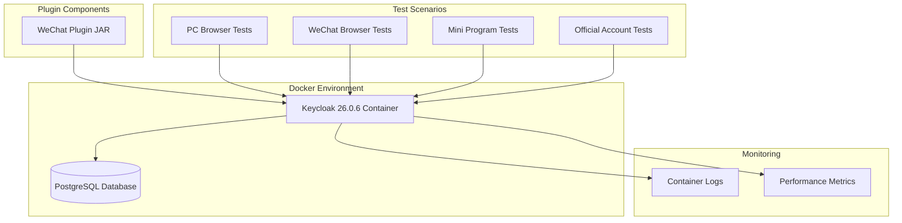
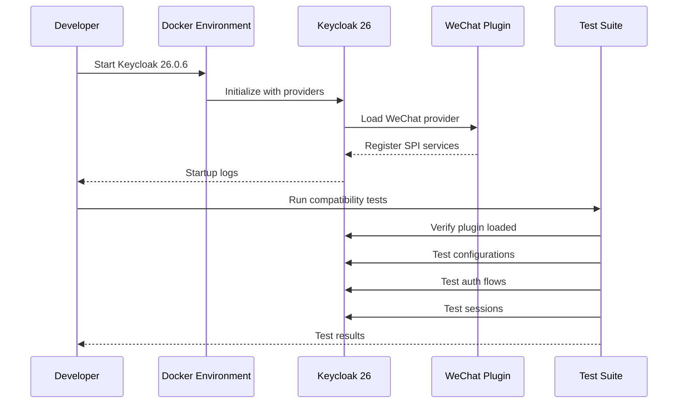

# Design Document

## Overview

This design outlines the approach for verifying and ensuring full compatibility of the keycloak-services-social-weixin plugin with Keycloak 26.x. The verification process will be comprehensive, covering plugin loading, configuration management, all authentication flows, session persistence, API compatibility, performance testing, and migration scenarios.

关键挑战 / Key challenges:
- Keycloak 26 默认启用持久化会话，需要验证插件的会话管理兼容性 / Keycloak 26 enables persistent sessions by default, requiring verification of plugin session management compatibility
- 序列化库从 JBoss Marshalling 改为 Infinispan Protostream / Marshalling library changed from JBoss Marshalling to Infinispan Protostream
- 需要验证所有四种微信登录方式的功能完整性 / Need to verify functionality of all four WeChat login methods

## Architecture

### 测试环境架构 / Test Environment Architecture



### 兼容性验证流程 / Compatibility Verification Flow



## Components and Interfaces

### 1. 环境设置组件 / Environment Setup Component

**目的 / Purpose**: 提供标准化的 Keycloak 26.x 测试环境 / Provide standardized Keycloak 26.x test environment

**关键文件 / Key Files**:
- `docker-compose.yml`: Docker 环境配置 / Docker environment configuration
- `test-env.sh`: 环境启动脚本 / Environment startup script
- `verify-plugin.sh`: 插件加载验证脚本 / Plugin loading verification script

### 2. 配置验证组件 / Configuration Verification Component

**目的 / Purpose**: 验证所有微信配置项在管理界面的可用性 / Verify all WeChat configuration options in admin UI

**验证点 / Verification Points**:
- 标准微信应用配置 / Standard WeChat app configuration
- 开放平台配置 / Open Platform configuration
- 小程序配置 / Mini Program configuration
- 公众号配置 / Official Account configuration

### 3. 认证流程测试组件 / Authentication Flow Test Component

**目的 / Purpose**: 测试所有微信登录方式 / Test all WeChat login methods

**测试矩阵 / Test Matrix**:
| 登录方式 / Login Method | User Agent | 预期行为 / Expected Behavior |
|------------------------|------------|----------------------------|
| PC扫码 / PC QR Code | Chrome/Firefox | 显示二维码 / Display QR code |
| 微信浏览器 / WeChat Browser | micromessenger | OAuth2重定向 / OAuth2 redirect |
| 小程序 / Mini Program | N/A | js_code交换 / js_code exchange |
| 公众号关注 / OA Follow | Chrome/Firefox | 带参二维码 / Parametric QR |

### 4. 会话管理验证组件 / Session Management Verification Component

**目的 / Purpose**: 验证与 Keycloak 26 持久化会话的兼容性 / Verify compatibility with Keycloak 26 persistent sessions

**测试场景 / Test Scenarios**:
- 会话创建和持久化 / Session creation and persistence
- 服务器重启后的会话恢复 / Session recovery after server restart
- 会话清理和登出 / Session cleanup and logout
- 禁用持久化会话时的降级处理 / Fallback when persistent sessions disabled

### 5. API兼容性检查组件 / API Compatibility Check Component

**目的 / Purpose**: 确保所有使用的 Keycloak API 仍然有效 / Ensure all used Keycloak APIs remain valid

**检查项 / Check Items**:
- SPI接口实现 / SPI interface implementations
- 身份代理API / Identity broker APIs
- 会话管理API / Session management APIs
- 用户联邦API / User federation APIs

### 6. 性能监控组件 / Performance Monitoring Component

**目的 / Purpose**: 确保插件性能符合标准 / Ensure plugin performance meets standards

**监控指标 / Monitoring Metrics**:
- 认证响应时间 / Authentication response time
- 并发处理能力 / Concurrent processing capability
- 资源使用情况 / Resource usage
- 错误率 / Error rate

## Data Models

### 1. 测试配置模型 / Test Configuration Model

```java
public class WeChatTestConfig {
    // 标准配置 / Standard config
    private String clientId;
    private String clientSecret;
    
    // 开放平台配置 / Open Platform config
    private String openClientId;
    private String openClientSecret;
    private boolean openClientEnabled;
    
    // 小程序配置 / Mini Program config
    private String wmpClientId;
    private String wmpClientSecret;
    
    // 公众号配置 / Official Account config
    private String clientId2;
    private String clientSecret2;
    private String customizedLoginUrl;
}
```

### 2. 测试结果模型 / Test Result Model

```java
public class CompatibilityTestResult {
    private String testName;
    private TestStatus status;
    private List<String> errors;
    private Map<String, Object> metrics;
    private long executionTime;
}

public enum TestStatus {
    PASSED,
    FAILED,
    SKIPPED,
    WARNING
}
```

### 3. 会话验证模型 / Session Verification Model

```java
public class SessionVerification {
    private String sessionId;
    private String userId;
    private String identityProvider;
    private boolean isPersisted;
    private boolean survivedRestart;
    private Map<String, String> sessionNotes;
}
```

## Error Handling

### 1. 插件加载错误 / Plugin Loading Errors

**错误类型 / Error Types**:
- SPI 注册失败 / SPI registration failure
- 类加载错误 / Class loading errors
- 依赖冲突 / Dependency conflicts

**处理策略 / Handling Strategy**:
- 详细的错误日志记录 / Detailed error logging
- 启动时的快速失败 / Fast failure at startup
- 清晰的错误消息指导 / Clear error message guidance

### 2. 配置错误 / Configuration Errors

**错误类型 / Error Types**:
- 缺少必需字段 / Missing required fields
- 无效的配置值 / Invalid configuration values
- 配置持久化失败 / Configuration persistence failure

**处理策略 / Handling Strategy**:
- 前端验证提示 / Frontend validation prompts
- 后端验证和错误返回 / Backend validation and error returns
- 配置回滚机制 / Configuration rollback mechanism

### 3. 认证流程错误 / Authentication Flow Errors

**错误类型 / Error Types**:
- 微信 API 调用失败 / WeChat API call failures
- 会话状态不一致 / Session state inconsistency
- 用户身份关联错误 / User identity linking errors

**处理策略 / Handling Strategy**:
- 优雅的降级处理 / Graceful degradation
- 用户友好的错误页面 / User-friendly error pages
- 详细的调试日志 / Detailed debug logging

### 4. 性能相关错误 / Performance Related Errors

**错误类型 / Error Types**:
- 响应超时 / Response timeout
- 资源耗尽 / Resource exhaustion
- 并发冲突 / Concurrency conflicts

**处理策略 / Handling Strategy**:
- 超时配置和重试 / Timeout configuration and retry
- 资源限制和监控 / Resource limits and monitoring
- 并发控制机制 / Concurrency control mechanisms

## Testing Strategy

### 1. 单元测试策略 / Unit Test Strategy

**范围 / Scope**:
- 所有核心组件的独立功能 / Independent functionality of all core components
- API 兼容性测试 / API compatibility tests
- 错误处理路径 / Error handling paths

**工具 / Tools**:
- JUnit 5
- Mockito
- PowerMock (for static mocking)

### 2. 集成测试策略 / Integration Test Strategy

**范围 / Scope**:
- 插件与 Keycloak 26 的集成 / Plugin integration with Keycloak 26
- 完整的认证流程 / Complete authentication flows
- 会话管理功能 / Session management functionality

**环境 / Environment**:
- Docker Compose 环境 / Docker Compose environment
- 真实的 Keycloak 26 实例 / Real Keycloak 26 instance
- PostgreSQL 数据库 / PostgreSQL database

### 3. 端到端测试策略 / End-to-End Test Strategy

**范围 / Scope**:
- 用户完整登录流程 / Complete user login flows
- 多种登录方式切换 / Switching between login methods
- 会话持久化和恢复 / Session persistence and recovery

**工具 / Tools**:
- Selenium WebDriver (PC 浏览器测试 / PC browser tests)
- 微信开发者工具 (小程序测试 / Mini Program tests)
- 手动测试清单 (微信浏览器 / WeChat browser)

### 4. 性能测试策略 / Performance Test Strategy

**范围 / Scope**:
- 认证响应时间 / Authentication response time
- 并发用户处理 / Concurrent user handling
- 资源使用监控 / Resource usage monitoring

**工具 / Tools**:
- JMeter
- Gatling
- Docker stats

### 5. 回归测试策略 / Regression Test Strategy

**范围 / Scope**:
- 确保现有功能不受影响 / Ensure existing functionality unaffected
- 版本升级后的功能验证 / Functionality verification after version upgrade
- 配置迁移验证 / Configuration migration verification

**执行时机 / Execution Timing**:
- 每次代码变更 / Every code change
- Keycloak 版本更新 / Keycloak version updates
- 依赖库更新 / Dependency library updates

## 设计决策和理由 / Design Decisions and Rationale

### 1. 使用 Docker Compose 进行测试环境管理
**理由 / Rationale**: 
- 确保测试环境的一致性和可重复性 / Ensures test environment consistency and reproducibility
- 简化 Keycloak 26 的部署和配置 / Simplifies Keycloak 26 deployment and configuration
- 便于集成到 CI/CD 流程 / Easy integration into CI/CD pipeline

### 2. 分层测试策略
**理由 / Rationale**:
- 快速识别问题层级 / Quickly identify problem layers
- 降低测试复杂度 / Reduce test complexity
- 提高测试覆盖率 / Improve test coverage

### 3. 保持向后兼容性
**理由 / Rationale**:
- 支持平滑升级路径 / Support smooth upgrade path
- 减少用户迁移成本 / Reduce user migration costs
- 维护配置的稳定性 / Maintain configuration stability

### 4. 详细的错误处理和日志
**理由 / Rationale**:
- 便于问题诊断 / Facilitate problem diagnosis
- 提升用户体验 / Improve user experience
- 支持生产环境故障排查 / Support production troubleshooting